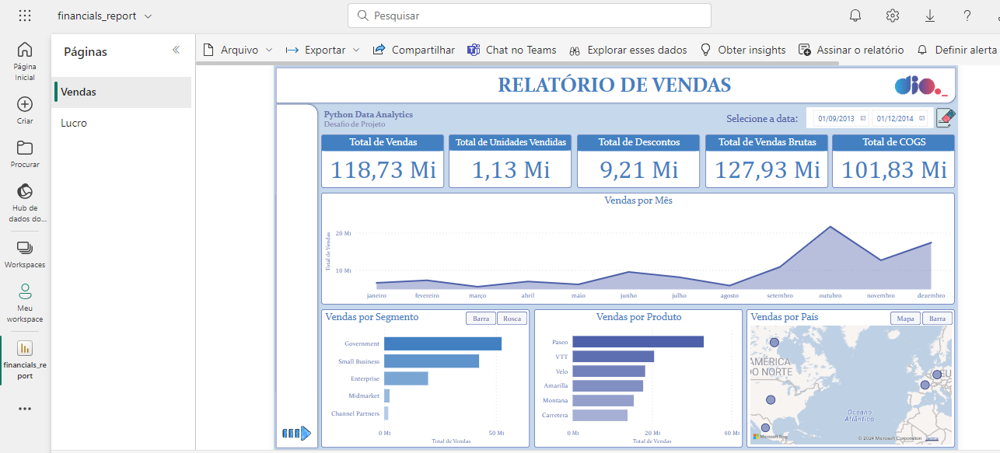
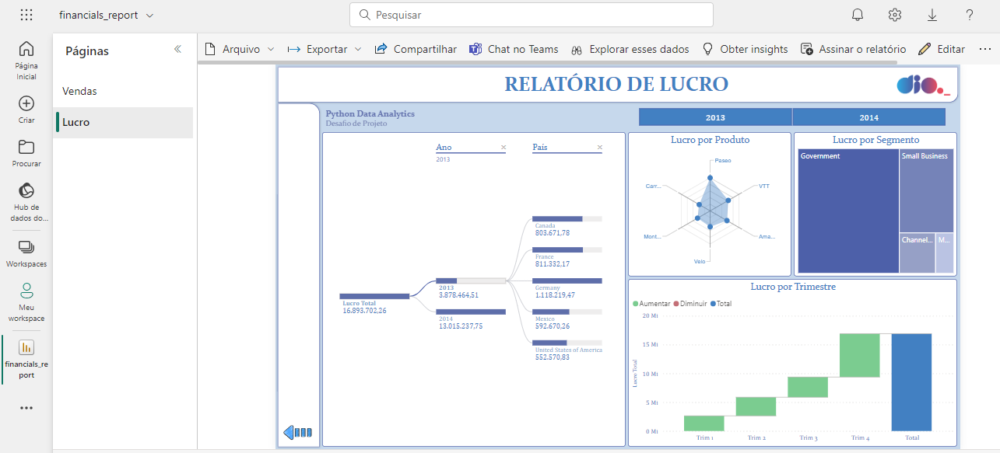

## Desafio de Projeto: **Criando um Relatório de Vendas Elegante com Power BI** 📊

Projeto desenvolvido durante o bootcamp *Coding The Future Squadio - Python Data Analytics*, oferecido pela [Digital Innovation One](https://www.dio.me/) no período de março a maio de 2024.

### Descrição do Projeto 📝

Este repositório contém o resultado do desafio proposto pela DIO para aprimorar habilidades em Power BI. O projeto consiste em criar um relatório elaborado com base nos dados financeiros da amostra *financials* do Power BI, utilizando recursos avançados para criar visualizações interativas e informativas.

### Recursos Fornecidos 📁

- Arquivos de dados financeiros de amostra;
- Vídeos de passo a passo para criação dos elementos do relatório.

### Requisitos do Desafio ✅

- Definição clara da estrutura do relatório;
- Implementação de botões de navegação para facilitar a interação;
- Utilização de segmentadores de dados e botões com imagem associada;
- Utilização de indicadores e botões para selecionar diferentes visuais sobre um mesmo assunto;
- Criação de visualizações informativas e atrativas;
- Publicação do relatório final no Power BI Service.

### Resultado 🏆

